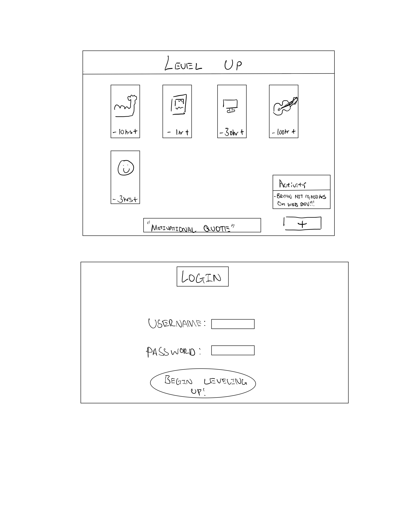

# Level Up

[My Notes](notes.md)

A brief description of the application here. 
This change was on github.

> [!NOTE]
>  This is a template for your startup application. You must modify this `README.md` file for each phase of your development. You only need to fill in the section for each deliverable when that deliverable is submitted in Canvas. Without completing the section for a deliverable, the TA will not know what to look for when grading your submission. Feel free to add additional information to each deliverable description, but make sure you at least have the list of rubric items and a description of what you did for each item.

> [!NOTE]
>  If you are not familiar with Markdown then you should review the [documentation](https://docs.github.com/en/get-started/writing-on-github/getting-started-with-writing-and-formatting-on-github/basic-writing-and-formatting-syntax) before continuing.

## 🚀 Specification Deliverable

> [!NOTE]
>  Fill in this sections as the submission artifact for this deliverable. You can refer to this [example](https://github.com/webprogramming260/startup-example/blob/main/README.md) for inspiration.

For this deliverable I did the following. I checked the box `[x]` and added a description for things I completed.

- [x] Proper use of Markdown
- [x] A concise and compelling elevator pitch
- [x] Description of key features
- [x] Description of how you will use each technology
- [x] One or more rough sketches of your application. Images must be embedded in this file using Markdown image references.

### Elevator pitch

You've probably heard that it takes 10,000 hours to master a skill. Have you ever wondered how many hours you've invested in something? Have you ever wondered what kind of progress you have made? Ever wonder what skills your friends are working on? Level Up is github version control but for humans. It allows us to track how much time has been put into specific skills and note our progress along the way. You can set goals, track habits and work with friends all to help you become the best version of yourself you can be. Six months to sexy has never been so easy. 

### Design

### Key features

- Secure login over HTTPS
- Realtime feedback when others begin new skills or reach milestones
- Progress is saved
- Ability to add or subtract number of hours invested in a skill
- Ability to add new skills a user wants to begin working on
- Ability to comment what a user has learned at certain point in time

### Technologies

I am going to use the required technologies in the following ways.

- **HTML** - Uses correct HTML structure for the application. Two HTML pages. One for the login and one for the progress tracker.
- **CSS** - Stylishly design the application so that it looks good on different screen sizes, demonstrates a consistent color scheme and is responsive.
- **React** - Provides login, increasing/ decreasing time spent on skill, comment, real time feedback of other users functionalities. 
- **Service** - Backend service endpoints for:
    - login
    - retrieving progress data
    - relaying progress data to others
    - API call to inspirational quotes
- **DB/Login** - Stores users progress and milestones
- **WebSocket** - Realtime data from other users, everytime a user starts a new skill or hits a milestone

## 🚀 AWS deliverable

For this deliverable I did the following. I checked the box `[x]` and added a description for things I completed.

- [x] **Server deployed and accessible with custom domain name** - [My server link](https://yourdomainnamehere.click).

## 🚀 HTML deliverable

For this deliverable I did the following. I checked the box `[x]` and added a description for things I completed.

- [x] **HTML pages** - I created 4 pages for my startup.
- [x] **Proper HTML element usage** - I used the specific element for the different functionalities of my website.
- [x] **Links** - I added links to reference other pages like git hub.
- [x] **Text** - I added more about my project.
- [x] **3rd party API placeholder** - I left a placeholder for the motivational quote api. 
- [x] **Images** - I added a placeholder image to show where my image would go.
- [x] **Login placeholder** - I have a login and password input box.
- [x] **DB data placeholder** - I incorporated a leaderboard functionality.
- [x] **WebSocket placeholder** - I have a placeholder for where realtime data will come in.

## 🚀 CSS deliverable

For this deliverable I did the following. I checked the box `[x]` and added a description for things I completed.

- [x] **Header, footer, and main content body** - All of these are formatted so that they resize well, and link where they are supposed to go. 
- [x] **Navigation elements** - All navigation buttons work as intended.
- [x] **Responsive to window resizing** - tables and cards resize well with the window.
- [x] **Application elements** - Structured the elements so that it would be easy to use.
- [x] **Application text content** - Changed the text font and colors. 
- [x] **Application images** - Replaced the placeholder image with a real image.

## 🚀 React part 1: Routing deliverable

For this deliverable I did the following. I checked the box `[x]` and added a description for things I completed.

- [x] **Bundled using Vite** - I did complete this part of the deliverable.
- [x] **Components** - I did complete this part of the deliverable.
- [x] **Router** - I did complete this part of the deliverable.

## 🚀 React part 2: Reactivity deliverable

For this deliverable I did the following. 
I added react capability for login, log, about and leaderboards. The api call and websockets functionalities are placeholders and show what it might look like. 
I checked the box `[x]` and added a description for things I completed.

- [X] **All functionality implemented or mocked out** - I did not complete this part of the deliverable.
- [X] **Hooks** - I did not complete this part of the deliverable.

## 🚀 Service deliverable

For this deliverable I did the following. I checked the box `[x]` and added a description for things I completed.

- [ ] **Node.js/Express HTTP service** - I did not complete this part of the deliverable.
- [ ] **Static middleware for frontend** - I did not complete this part of the deliverable.
- [ ] **Calls to third party endpoints** - I did not complete this part of the deliverable.
- [ ] **Backend service endpoints** - I did not complete this part of the deliverable.
- [ ] **Frontend calls service endpoints** - I did not complete this part of the deliverable.
- [ ] **Supports registration, login, logout, and restricted endpoint** - I did not complete this part of the deliverable.

## 🚀 DB deliverable

For this deliverable I did the following. I checked the box `[x]` and added a description for things I completed.

- [ ] **Stores data in MongoDB** - I did not complete this part of the deliverable.
- [ ] **Stores credentials in MongoDB** - I did not complete this part of the deliverable.

## 🚀 WebSocket deliverable

For this deliverable I did the following. I checked the box `[x]` and added a description for things I completed.

- [ ] **Backend listens for WebSocket connection** - I did not complete this part of the deliverable.
- [ ] **Frontend makes WebSocket connection** - I did not complete this part of the deliverable.
- [ ] **Data sent over WebSocket connection** - I did not complete this part of the deliverable.
- [ ] **WebSocket data displayed** - I did not complete this part of the deliverable.
- [ ] **Application is fully functional** - I did not complete this part of the deliverable.
