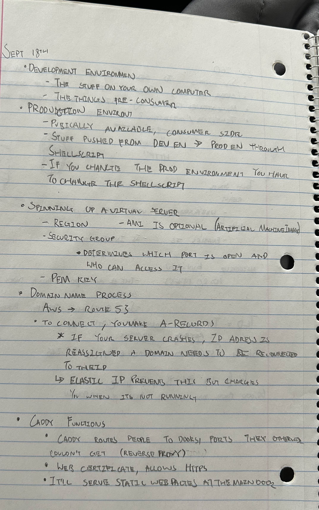

# CS 260 Notes

[My startup - Simon](https://simon.cs260.click)

## Helpful links

- [Course instruction](https://github.com/webprogramming260)
- [Canvas](https://byu.instructure.com)
- [MDN](https://developer.mozilla.org)

## What I learned 
I had never used git hub apart from uploading a website before so this was all new to me. Initially I was very confused as to what the purpose was. However I learned why github is important as well as important console commands such as git push and git commit. It will take a bit more practice but I can see how using github could be very beneficial in the long run. 

These commands are crucial to git:
```
git status

git add test.md
git commit -am "update notes go here"
git push 

git fetch 
git status
git pull

cd ~/byu/cs260
git clone https://github.com/YOURACCOUNTHERE/startup.git
cd startup
```
Status will check whether there are discrepencies between the github version and the local version. Add will put the file in the staging area". Commit will snapshot the staged files and everything -am is a message that is included in the commit. Push pushes the changes to the original repository. Fetch gives information about the original repository. Pull will update the local files to match the repository. Clone will clone the repository into a directory, **make sure to be cd'ed into the correct directory**.  

## AWS

My IP address is: http://54.81.53.56/
One hiccup I ran into was I was accidentally searching https://54.81.53.56/ instead of http://54.81.53.56/. As it is right now, it is not secured https, it is unsecure. 
An elastic IP address is one that doesn't change even when the server is turned off. Otherwise it would change every time.
To SSH into my server it looks like

```
ssh -i [key pair file] ubuntu@[ip address]
ssh -i ~/keys/production.pem ubuntu@53.104.2.123

chmod  600 yourkeypairfile.pem
```
Chmod restricts permissions on the file to make it more secure. 

## Caddy

No problems worked just like it said in the [instruction](https://github.com/webprogramming260/.github/blob/main/profile/webServers/https/https.md).


## HTML

These are the notes for everything covered in clase up to HTML:


Some useful HTML Commands I learned:
Elements for accepting user input:

| Element    | Meaning                          | Example                                        |
| ---------- | -------------------------------- | ---------------------------------------------- |
| `form`     | Input container and submission   | `<form action="form.html" method="post">`      |
| `fieldset` | Labeled input grouping           | `<fieldset> ... </fieldset>`                   |
| `input`    | Multiple types of user input     | `<input type="" />`                            |
| `select`   | Selection dropdown               | `<select><option>1</option></select>`          |
| `optgroup` | Grouped selection dropdown       | `<optgroup><option>1</option></optgroup>`      |
| `option`   | Selection option                 | `<option selected>option2</option>`            |
| `textarea` | Multiline text input             | `<textarea></textarea>`                        |
| `label`    | Individual input label           | `<label for="range">Range: </label>`           |
| `output`   | Output of input                  | `<output for="range">0</output>`               |
| `meter`    | Display value with a known range | `<meter min="0" max="100" value="50"></meter>` |

Input types:
The input element represents many different input types. You set the type of input with the `type` attribute. There are several different types to choose from. This includes different flavors of textual, numeric, date, and color inputs.

| Type           | Meaning                           |
| -------------- | --------------------------------- |
| text           | Single line textual value         |
| password       | Obscured password                 |
| email          | Email address                     |
| tel            | Telephone number                  |
| url            | URL address                       |
| number         | Numerical value                   |
| checkbox       | Inclusive selection               |
| radio          | Exclusive selection               |
| range          | Range limited number              |
| date           | Year, month, day                  |
| datetime-local | Date and time                     |
| month          | Year, month                       |
| week           | Week of year                      |
| color          | Color                             |
| file           | Local file                        |
| submit         | button to trigger form submission |


Media:
```
//Audio
<audio controls src="testAudio.mp3"></audio>
//Video
<video controls width="300" crossorigin="anonymous">
  <source src="https://commondatastorage.googleapis.com/gtv-videos-bucket/sample/BigBuckBunny.mp4" />
</video>
//Vector Graphics
<svg viewBox="0 0 300 200" xmlns="http://www.w3.org/2000/svg" stroke="red" fill="red" style="border: 1px solid #000000">
  <circle cx="150" cy="100" r="50" />
</svg>
//Canvas
<canvas id="canvasDemo" width="300" height="200" style="border: 1px solid #000000"></canvas>
<script>
  const ctx = document.getElementById('canvasDemo').getContext('2d');
  ctx.beginPath();
  ctx.arc(150, 100, 50, 0, 2 * Math.PI);
  ctx.fillStyle = 'red';
  ctx.strokeStyle = 'red';
  ctx.fill();
  ctx.stroke();
</script>
```


This was easy. I was careful to use the correct structural elements such as header, footer, main, nav, and form. The links between the three views work great using the `a` element.

The part I didn't like was the duplication of the header and footer code. This is messy, but it will get cleaned up when I get to React.

## CSS

This took a couple hours to get it how I wanted. It was important to make it responsive and Bootstrap helped with that. It looks great on all kinds of screen sizes.

Bootstrap seems a bit like magic. It styles things nicely, but is very opinionated. You either do, or you do not. There doesn't seem to be much in between.

I did like the navbar it made it super easy to build a responsive header.

```html
      <nav class="navbar navbar-expand-lg bg-body-tertiary">
        <div class="container-fluid">
          <a class="navbar-brand">
            
            Calmer
          </a>
          <button class="navbar-toggler" type="button" data-bs-toggle="collapse" data-bs-target="#navbarSupportedContent">
            <span class="navbar-toggler-icon"></span>
          </button>
          <div class="collapse navbar-collapse" id="navbarSupportedContent">
            <ul class="navbar-nav me-auto mb-2 mb-lg-0">
              <li class="nav-item">
                <a class="nav-link active" href="play.html">Play</a>
              </li>
              <li class="nav-item">
                <a class="nav-link" href="about.html">About</a>
              </li>
              <li class="nav-item">
                <a class="nav-link" href="index.html">Logout</a>
              </li>
            </ul>
          </div>
        </div>
      </nav>
    </header>
```

I also used SVG to make the icon and logo for the app. This turned out to be a piece of cake.

```html
<svg width="100" height="100" xmlns="http://www.w3.org/2000/svg">
  <rect width="100" height="100" fill="#0066aa" rx="10" ry="10" />
  <text x="50%" y="50%" dominant-baseline="central" text-anchor="middle" font-size="72" font-family="Arial" fill="white">C</text>
</svg>
```

## React Part 1: Routing

Setting up Vite and React was pretty simple. I had a bit of trouble because of conflicting CSS. This isn't as straight forward as you would find with Svelte or Vue, but I made it work in the end. If there was a ton of CSS it would be a real problem. It sure was nice to have the code structured in a more usable way.

Here is some really important steps that helped me understand:
1. Install and configure Vite
1. Reorganize the code
1. Convert to React Bootstrap
1. Enable React
1. Create app component
1. Create view components
1. Create the router
1. Convert HTML to React components
1. Replace deployment script

The structure of the files should look like this
```sh
├─ public                      # Static assets used in the app
│   ├─ favicon.ico
│   └─ placeholder.jpg
└─ src                         # Frontend React code
    ├─ app.css                 # Top level styles
    ├─ about                   # About component
    ├─ login                   # Login component
    ├─ play                    # Game play component
    └─ scores                  # Scores component

```
The app.css houses top level styling. App.jsx houses header and footer, aka things you don't want ot have to reload everytime. 

```html
<!DOCTYPE html>
<html lang="en">
  <head>
    <meta charset="utf-8" />
    <link rel="icon" href="/favicon.ico" />
    <meta name="viewport" content="width=device-width, initial-scale=1" />
    <meta name="theme-color" content="#000000" />

    <title>Simon React</title>
  </head>
  <body>
    <noscript>You need to enable JavaScript to run this app.</noscript>
    <div id="root"></div>
    <script type="module" src="/index.jsx"></script>
  </body>
</html>
```
This is the key to the index.html. Everything will come from here since this is where the shadow root is created. 

**app.jsx**

```jsx
import React from 'react';
import 'bootstrap/dist/css/bootstrap.min.css';
import './app.css';

export default function App() {
  return <div className="body bg-dark text-light">App will display here</div>;
}
```
App.Jsx should initally look like this. But replace the "app will display here" with the headers and the footers. 

```jsx
 <main>App components go here</main>

 // to
```jsx
<a className="nav-link" href="play.html">Play</a>

// to

<NavLink className='nav-link' to='play'>Play</NavLink>
```

<Routes>
  <Route path='/' element={<Login />} exact />
  <Route path='/play' element={<Play />} />
  <Route path='/scores' element={<Scores />} />
  <Route path='/about' element={<About />} />
  <Route path='*' element={<NotFound />} />
</Routes>
```
Code for routes.

```jsx
<div className="input-group sound-button-container">
  {calmSoundTypes.map((sound, index) => (
    <div key={index} className="form-check form-switch">
      <input
        className="form-check-input"
        type="checkbox"
        value={sound}
        id={sound}
        onChange={() => togglePlay(sound)}
        checked={selectedSounds.includes(sound)}
      ></input>
      <label className="form-check-label" htmlFor={sound}>
        {sound}
      </label>
    </div>
  ))}
</div>
```
```js
function NotFound() {
  return <main className="container-fluid bg-secondary text-center">404: Return to sender. Address unknown.</main>;
}
```
This is in the even that the path is not found. 

```sh
├─ LICENSE
├─ README.md
├─ deployReact.sh              # React specific deployment
├─ index.html                  # Single HTML file for the App
├─ index.jsx                   # Loads the top level component
├─ package.json                # Defines dependent modules
├─ public                      # Static assets used in the app
│   ├─ favicon.ico
│   └─ placeholder.jpg
└─ src                         # Frontend React code
    ├─ app.jsx                 # Top level component
    ├─ app.css
    ├─ about                   # About component
    │   ├─ about.css
    │   └─ about.jsx
    ├─ login                   # Login component
    │   └─ login.jsx
    ├─ play                    # Game play component
    │   ├─ play.jsx
    │   └─ play.css
    └─ scores                  # Scores component
        ├─ scores.css
        └─ scores.jsx
```
High level overview of simon and what it looks like after everything is finished.

## React Part 2: Reactivity

Basic Javascript Functions:
```
// print to console
console.log("hello world)
//timers
console.time('demo time');
for (let i = 0; i < 10000000; i++) {}
// ... some code that takes a long time.
console.timeEnd('demo time');
// OUTPUT: demo time: 12.74 ms
// Counter function 
console.count('a');
// OUTPUT: a: 1
console.count('a');
// OUTPUT: a: 2
console.count('b');
// OUTPUT: b: 1
```

Parameters:
```
function labeler(value, title = 'title') {
  console.log(`${title}=${value}`);
}

labeler();
// OUTPUT: title=undefined

labeler('fish');
// OUTPUT: title=fish

labeler('fish', 'animal');
// OUTPUT: animal=fish
```
Anonymous Functions:
```
// Function that takes a function as a parameter
function doMath(operation, a, b) {
  return operation(a, b);
}

// Anonymous function assigned to a variable
const add = function (a, b) {
  return a + b;
};

console.log(doMath(add, 5, 3));
// OUTPUT: 8

// Anonymous function assigned to a parameter
console.log(
  doMath(
    function (a, b) {
      return a - b;
    },
    5,
    3
  )
);
// OUTPUT: 2
```

Named functions are hoisted (the top of the scope which means they can be run even before they are declared), anonymous functions are unhoisted.

Arrow Function:
```
const a = [1, 2, 3, 4];

// standard function syntax
a.sort(function (v1, v2) {
  return v1 - v2;
});

// arrow function syntax
a.sort((v1, v2) => v1 - v2);

//return functions work like this
() => 3;
// RETURNS: 3

() => {
  3;
};
// RETURNS: undefined

() => {
  return 3;
};
// RETURNS: 3
```
Arrow functions and usestate:
```
function App() {
  const [count, setCount] = React.useState(0);

  function counterOpFactory(op) {
    return () => setCount((prevCount) => op(prevCount));
  }

  const incOp = counterOpFactory((c) => c + 1);
  const decOp = counterOpFactory((c) => c - 1);
  const tenXOp = counterOpFactory((c) => c * 10);

  return (
    <div>
      <h1>Count: {count}</h1>
      <button onClick={incOp}>n++</button>
      <button onClick={decOp}>n--</button>
      <button onClick={tenXOp}>n*10</button>
    </div>
  );
}
```
[count,setcount] = React.useState(0) means set the count at zero. Setcount is a function that rerenders the object (its very complicated so don't worry about it for now).
Local Storage:

Local storage allows the storage and retrieval of data on a users browser across sessions and renderings. This even works between different html pages. 

This was a lot of fun to see it all come together. I had to keep remembering to use React state instead of just manipulating the DOM directly.

Handling the toggling of the checkboxes was particularly interesting.
There are four main functions that can be used with localStorage.

| Function             | Meaning                                      |
| -------------------- | -------------------------------------------- |
| setItem(name, value) | Sets a named item's value into local storage |
| getItem(name)        | Gets a named item's value from local storage |
| removeItem(name)     | Removes a named item from local storage      |
| clear()              | Clears all items in local storage            |

A local storage value must be of type `string`, `number`, or `boolean`. If you want to store a JavaScript object or array, then you must first convert it to a JSON string with `JSON.stringify()` on insertion, and parse it back to JavaScript with `JSON.parse()` when retrieved.
Object sample (class == map == dictionary):
```
const obj = {
  a: 3,
  b: 'fish',
};

console.log(Object.entries(obj));
// OUTPUT: [['a', 3], ['b', 'fish']]
console.log(Object.keys(obj));
// OUTPUT: ['a', 'b']
console.log(Object.values(obj));
// OUTPUT: [3, 'fish']
```

Constructor sample:
```
function Person(name) {
  return {
    name: name,
  };
}

const p = new Person('Eich');
console.log(p);
// OUTPUT: {name: 'Eich'}
```
Class sample
```
class Person {
  constructor(name) {
    this.name = name;
  }
// you can also do like below to make the func/ property private
// #name
// constructor(name){
//    this.#name = name;
//} 
  log() {
    console.log('My name is ' + this.name);
  }
}

const p = new Person('Eich');
p.log();
// OUTPUT: My name is Eich
```
Inheritance/ extends sample:
```
class Person {
  constructor(name) {
    this.name = name;
  }

  print() {
    return 'My name is ' + this.name;
  }
}

class Employee extends Person {
  constructor(name, position) {
    super(name);
    this.position = position;
  }

  print() {
    return super.print() + '. I am a ' + this.position;
  }
}

const e = new Employee('Eich', 'programmer');
console.log(e.print());
// OUTPUT: My name is Eich. I am a programmer
```
Settime out/ setinterval:
```
setTimeout(() => console.log('time is up'), 2000);

console.log('timeout will happen later');
```
Set timeout halts the console.log("time is up") for 2000 miliseconds, keeps executing code beneath it, and then execultes the arrow function once the time is up. Meaning "timeout will happen later" will actually print first!.

Converting Json:
```const obj = { a: 2, b: 'crockford', c: undefined };
const json = JSON.stringify(obj);
const objFromJson = JSON.parse(json);

console.log(obj, json, objFromJson);

// OUTPUT:
// {a: 2, b: 'crockford', c: undefined}
// {"a":2, "b":"crockford"}
// {a: 2, b: 'crockford'}
```
Destructuring:
Only applicable to arrays or objects. This is what is happening when usestate() is called. 
```
const a = [1, 2, 4, 5];

// destructure the first two items from a, into the new variables b and c
const [b, c] = a;

console.log(b, c);
// OUTPUT: 1, 2
const [b, c, ...others] = a;

console.log(b, c, others);
// OUTPUT: 1, 2, [4,5]

//Objects
const o = { a: 1, b: 'animals', c: ['fish', 'cats'] };

const { a: count, b: type } = o;

console.log(count, type);
// OUTPUT 1, animals

//Passing default values
const { a, b = 22 } = {};
const [c = 44] = [];
console.log(a, b, c);
// OUTPUT: undefined, 22, 44
```
Hooks:
Hooks are functions that let you "hook into" React state and lifecycle features from functional components. Provides access to state, props, lifecycle etc.
Examples:
```
//usestate
function Clicker({ initialCount }) {
  const [count, updateCount] = React.useState(initialCount);
  return <div onClick={() => updateCount(count + 1)}>Click count: {count}</div>;
}

const root = ReactDOM.createRoot(document.getElementById('root'));
root.render(<Clicker initialCount={3} />);

//useeffect
function UseEffectHookDemo() {
  React.useEffect(() => {
    console.log('rendered');
  });

  return <div>useEffectExample</div>;
}

const root = ReactDOM.createRoot(document.getElementById('root'));
root.render(<UseEffectHookDemo />);
// Everytime the component is rendered, console logs rendered.

//use effect cleanup
function Clicker() {
  const [count, update] = React.useState(5);

  return (
    <div onClick={() => update(count - 1)}>
      Click count: {count}
      {count > 0 ? <Db /> : <div>DB Connection Closed</div>}
    </div>
  );
}

function Db() {
  React.useEffect(() => {
    console.log('connected');

    return function cleanup() {
      console.log('disconnected');
    };
  }, []);

  return <div>DB Connection</div>;
}

const root = ReactDOM.createRoot(document.getElementById('root'));
root.render(<Clicker />);
```

? syntax in JSX:
```
condition ? valueIfTrue : valueIfFalse
```
ValueIfTrue will be rendered if condition (how javascript evaluates boolean) is True. Otherwise, it will render ValueIfFalse.

## React Part 2 
```
const delay = (msg, wait) => {
  setTimeout(() => {
    console.log(msg, wait);
  }, 1000 * wait);
};

new Promise((resolve, reject) => {
  // Code executing in the promise
  for (let i = 0; i < 3; i++) {
    delay('In promise', i);
  }
});

// Code executing after the promise
for (let i = 0; i < 3; i++) {
  delay('After promise', i);
}

// OUTPUT:
//   In promise 0
//   After promise 0
//   In promise 1
//   After promise 1
//   In promise 2
//   After promise 2
```
Set Timeout(() => {function}, duration of timeout in ms); 
Promise
```
const coinToss = new Promise((resolve, reject) => {
  setTimeout(() => {
    if (Math.random() > 0.1) {
      resolve(Math.random() > 0.5 ? 'heads' : 'tails');
    } else {
      reject('fell off table');
    }
  }, 10000);
});

let promise = new Promise((resolve, reject) => {
  // Executor function
  // Asynchronous code goes here
});
```
The code above creates a cointoss variable and assigns it to a promise object. The format for a promise object:
```
let promise = new Promise((resolve, reject) => {
  // Executor function
  // Asynchronous code goes here
});
```

You cannot use await unless it is called at the top level of the Javascript, or it is a function that uses async. 

```
async function cow() {
  return new Promise((resolve) => {
    resolve('moo');
  });
}
console.log(cow());
// OUTPUT: Promise {<pending>}
```
This is still pending because console log is called immidietely after cow is, not giving time for the promise to be resolve. Await makes it wait:
```
console.log(cow());
// OUTPUT: Promise {<pending>}

console.log(await cow());
// OUTPUT: moo
```
Examples of Async and Await:
Here the console outputs done before the email and authentication is outputted 
```
const httpPromise = fetch('https://simon.cs260.click/api/user/me');
const jsonPromise = httpPromise.then((r) => r.json());
jsonPromise.then((j) => console.log(j));
console.log('done');

// OUTPUT: done
// OUTPUT: {email: 'bud@mail.com', authenticated: true}
```
But using await it will work properly:
```
const httpResponse = await fetch('https://simon.cs260.click/api/user/me');
const jsonResponse = await httpResponse.json();
console.log(jsonResponse);
console.log('done');

// OUTPUT: {email: 'bud@mail.com', authenticated: true}
// OUTPUT: done
```
How does caddy work with ports?
"Your web service, Caddy, is listening on ports 80 and 443. When Caddy gets a request on port 80, it automatically redirects the request to port 443 so that a secure connection is used. When Caddy gets a request on port 443 it examines the path provided in the HTTP request (as defined by the URL) and if the path matches a static file, it reads the file off disk and returns it. If the HTTP path matches one of the definitions it has for a gateway service, Caddy makes a connection on that service's port (e.g. 3000 or 4000) and passes the request to the service.

Internally on your web server, you can have as many web services running as you would like. However, you must make sure that each one uses a different port to communicate on. You run your Simon service on port 3000 and therefore cannot use port 3000 for your startup service. Instead you use port 4000 for your startup service. It does not matter what high range port you use. It only matters that you are consistent and that they are only used by one service."

GET requests:
They generally take on this form.
```
//Syntax
<verb> <url path, parameters, anchor> <version>
[<header key: value>]*
[

  <body>
]
//Example
GET /hypertext/WWW/Helping.html HTTP/1.1  // Version of http that is being used.
Host: info.cern.ch
Accept: text/html

// Example output

HTTP/1.1 200 OK
Date: Tue, 06 Dec 2022 21:54:42 GMT
Server: Apache
Last-Modified: Thu, 29 Oct 1992 11:15:20 GMT
ETag: "5f0-28f29422b8200"
Accept-Ranges: bytes
Content-Length: 1520
Connection: close
Content-Type: text/html

<TITLE>Helping -- /WWW</TITLE>
<NEXTID 7>
<H1>How can I help?</H1>There are lots of ways you can help if you are interested in seeing
the <A NAME=4 HREF=TheProject.html>web</A> grow and be even more useful...
```

## Verbs

There are several verbs that describe what the HTTP request is asking for. The list below only describes the most common ones.

| Verb    | Meaning                                                                                                                                                                                                                                                  |
| ------- | -------------------------------------------------------------------------------------------------------------------------------------------------------------------------------------------------------------------------------------------------------- |
| GET     | Get the requested resource. This can represent a request to get a single resource or a resource representing a list of resources.                                                                                                                        |
| POST    | Create a new resource. The body of the request contains the resource. The response should include a unique ID of the newly created resource.                                                                                                             |
| PUT     | Update a resource. Either the URL path, HTTP header, or body must contain the unique ID of the resource being updated. The body of the request should contain the updated resource. The body of the response may contain the resulting updated resource. |
| DELETE  | Delete a resource. Either the URL path or HTTP header must contain the unique ID of the resource to delete.                                                                                                                                              |
| OPTIONS | Get metadata about a resource. Usually only HTTP headers are returned. The resource itself is not returned.                                                                                                                                              |

## Status codes
- 1xx - Informational.
- 2xx - Success.
- 3xx - Redirect to some other location, or that the previously cached resource is still valid.
- 4xx - Client errors. The request is invalid.
- 5xx - Server errors. The request cannot be satisfied due to an error on the server.

| Code | Text                                                                                 | Meaning                                                                                                                           |
| ---- | ------------------------------------------------------------------------------------ | --------------------------------------------------------------------------------------------------------------------------------- |
| 100  | Continue                                                                             | The service is working on the request                                                                                             |
| 200  | Success                                                                              | The requested resource was found and returned as appropriate.                                                                     |
| 201  | Created                                                                              | The request was successful and a new resource was created.                                                                        |
| 204  | No Content                                                                           | The request was successful but no resource is returned.                                                                           |
| 304  | Not Modified                                                                         | The cached version of the resource is still valid.                                                                                |
| 307  | Permanent redirect                                                                   | The resource is no longer at the requested location. The new location is specified in the response location header.               |
| 308  | Temporary redirect                                                                   | The resource is temporarily located at a different location. The temporary location is specified in the response location header. |
| 400  | Bad request                                                                          | The request was malformed or invalid.                                                                                             |
| 401  | Unauthorized                                                                         | The request did not provide a valid authentication token.                                                                         |
| 403  | Forbidden                                                                            | The provided authentication token is not authorized for the resource.                                                             |
| 404  | Not found                                                                            | An unknown resource was requested.                                                                                                |
| 408  | Request timeout                                                                      | The request takes too long.                                                                                                       |
| 409  | Conflict                                                                             | The provided resource represents an out of date version of the resource.                                                          |
| 418  | [I'm a teapot](https://en.wikipedia.org/wiki/Hyper_Text_Coffee_Pot_Control_Protocol) | The service refuses to brew coffee in a teapot.                                                                                   |
| 429  | Too many requests                                                                    | The client is making too many requests in too short of a time period.                                                             |
| 500  | Internal server error                                                                | The server failed to properly process the request.                                                                                |
| 503  | Service unavailable                                                                  | The server is temporarily down. The client should try again with an exponential back off.                                         |

## Headers

HTTP headers specify metadata about a request or response. This includes things like how to handle security, caching, data formats, and cookies. Some common headers that you will use include the following.

| Header                      | Example                              | Meaning                                                                                                                                                                        |
| --------------------------- | ------------------------------------ | ------------------------------------------------------------------------------------------------------------------------------------------------------------------------------ |
| Authorization               | Bearer bGciOiJIUzI1NiIsI             | A token that authorized the user making the request.                                                                                                                           |
| Accept                      | image/\*                             | The format the client accepts. This may include wildcards.                                                                                                            |
| Content-Type                | text/html; charset=utf-8             | The format of the content being sent. These are described using standard [MIME](https://developer.mozilla.org/en-US/docs/Web/HTTP/Basics_of_HTTP/MIME_types/Common_types) types. |
| Cookie                      | SessionID=39s8cgj34; csrftoken=9dck2 | Key value pairs that are generated by the server and stored on the client.                                                                                                     |
| Host                        | info.cern.ch                         | The domain name of the server. This is required in all requests.                                                                                                               |
| Origin                      | cs260.click                          | Identifies the origin that caused the request. A host may only allow requests from specific origins.                                                                           |
| Access-Control-Allow-Origin | https://cs260.click                  | Server response of what origins can make a request. This may include a wildcard.                                                                                               |
| Content-Length              | 368                                  | The number of bytes contained in the response.                                                                                                                                 |
| Cache-Control               | public, max-age=604800               | Tells the client how it can cache the response.                                                                                                                                |
| User-Agent                  | Mozilla/5.0 (Macintosh)              | The client application making the request.                                                                                                                                     |
## Cookies
HTTP is stateless, meaning it has no connection to previous or future requests. One way states are tracked are through cookies. Cookies are set this way.
```
HTTP/2 200
Set-Cookie: myAppCookie=tasty; SameSite=Strict; Secure; HttpOnly
```

# Fetch
Fetch takes a URL and returns a promise object. Using .then takes a callback function and runs it with on the promise object. A common one is .json() if the return content is of type "application.json".
Callback functions are functions passed as arguments to be laterused when a condition is met.
```
fetch('https://quote.cs260.click')
  .then((response) => response.json())
  .then((jsonResponse) => {
    console.log(jsonResponse);
  });

//When a method is not specified using fetch, it defaults to GET.

fetch('https://jsonplaceholder.typicode.com/posts', {
  method: 'POST',
  body: JSON.stringify({
    title: 'test title',
    body: 'test body',
    userId: 1,
  }),
  headers: {
    'Content-type': 'application/json; charset=UTF-8',
  },
})
  .then((response) => response.json())
  .then((jsonResponse) => {

    console.log(jsonResponse);
  });``
```
## JavaScript Modules
Modules enable the sharing of code. Common JS:
To import common js modules/ or npm packages, use this syntax:
```
const express = require('express');
const DB = require('./database.js')
```
To export something from your own code, do this:
```
function alertDisplay(msg) {
  alert(msg);
}

module.exports = {
  alertDisplay,
};
```
ES Modules
Importing:
```
import express from 'express';

express().listen(3000);
```
Exporting
```
export function alertDisplay(msg) {
  console.log(msg);
}
```
The difference between ES and CommonJS is common JS is older and ES is newer. The major difference is, import is an asynchronous means of including modules, where as require is synchronous. CommonJS does not support async in the root of a module, import itself does exist in CommonJS, just not in the root level of a module (file). If you create an async function, you can all and await import from inside of it.

ESM will handle the root level async imports for you, and provide a whole realm of future features going forward.

ESM can consume and use CommonJS modules, but CommonJS cannot consume ESM modules, it's a one way street. A module either has to explicitly output both an ESM and a CommonJS output, and be configured in such a way that it exposes both in a resolvable fashion. In some cases people use a simple wrapper to achieve this, but it does not come without it's pains.

This is mostly only an issue if you're building something with the intention of publishing it to npm where it will be consumed by a wider audience. Because whether or not you support both impacts who can consume your API.

ES Modules in HTML:
To be able to use it in browser HTML, you can declare the script type as a module:
```
<script type="module">
  import { alertDisplay } from './alert.js';
  alertDisplay('module loaded');
</script>
```
To allow the use of modules outside the scope of the scripts, you must leak the module into the global scope by attaching event handlers or adding a function to the global window object.
```
<html>
  <body>
    <script type="module">
      import { alertDisplay } from './alert.js';
      window.btnClick = alertDisplay;

      document.body.addEventListener('keypress', function (event) {
        alertDisplay('Key pressed');
      });
    </script>
    <button onclick="btnClick('button clicked')">Press me</button>
  </body>
</html>

#or
import { alertDisplay } from './alertModule.js';

// Expose it globally
window.alertDisplay = alertDisplay;

// Optionally, attach it to an event
window.addEventListener('keypress', event => {
  if (event.key === 'a') {
    alertDisplay('You pressed "a"');
  }
});
```
##Same Origin Policy (SOP) and Cross Origin Resource Sharing (CORS):
SOP means that javascript only allows make requests to a domain if its the same domain the user is currently viewing. A request from byu.iinstructure.com for service endpoints that are made to byu.instructure.com would fail because the domains do not match. Because a user may have cookies (with authentication or session credentials) and they are passed to all visited websites, without SOP, websites could yoink those cookies and use them to make requests somewhere else. 

CORS allows the client (e.g. browser) to specify the origin of a request and then let the server respond with what origins are allowed. The server may say that all origins are allowed, for example if they are a general purpose image provider, or only a specific origin is allowed, for example if they are a bank's authentication service. If the server doesn't specify what origin is allowed then the browser assumes that it must be the same origin. Kinda like a robots.txt but for make requests and they are


## Mongo Db
Mongo DB is a nosql database. Below is an example query
```
// Database 
[
  {
    _id: '62300f5316f7f58839c811de',
    name: 'Lovely Loft',
    summary: 'A charming loft in Paris',
    beds: 1,
    last_review: {
      $date: '2022-03-15T04:06:17.766Z',
    },
    price: 3000,
  },
  {
    _id: '623010b97f1fed0a2df311f8',
    name: 'Infinite Views',
    summary: 'Modern home with infinite views from the infinity pool',
    property_type: 'House',
    beds: 5,
    price: 250,
  },
];


// find all houses
db.house.find();

// find houses with two or more bedrooms
db.house.find({ beds: { $gte: 2 } });

// find houses that are available with less than three beds
db.house.find({ status: 'available', beds: { $lt: 3 } });

// find houses with either less than three beds or less than $1000 a night
db.house.find({ $or: [(beds: { $lt: 3 }), (price: { $lt: 1000 })] });

// find houses with the text 'modern' or 'beach' in the summary
db.house.find({ summary: /(modern|beach)/i });
```


## MIDTERM QUESTIONS

### In the following code, what does the link element do?
It links an external resource (usually a CSS file) to the HTML document. Example: 
```
<link rel="stylesheet"
href="styles.css">
```
applies styles from styles.css to the page.

### In the following code,  what does a div tag do?
```
<div>
  <p>This is inside a div</p>
</div>
```
div is a container element used to group other HTML elements together. It has no visual
effect by itself, but helps structure the page for styling and layout using CSS. Commonly used
for sections, wrappers, and layout blocks

### In the following code, what is the difference between the #title and .grid selector?
. is for classes, # is for id's

### In the following code, what is the difference between padding and margin?
Padding: space inside the element (between content and border). Margin: space outside the element (between
border and other elements).

```
div {
  padding: 25px 50px 75px 100px;
}
//If the padding property has three values:

//padding: 25px 50px 75px;
//top padding is 25px
//right and left paddings are 50px
//bottom padding is 75px
//Example
//Use the padding shorthand property with three values: 

div {
  padding: 25px 50px 75px;
}
//If the padding property has two values:

//padding: 25px 50px;
//top and bottom paddings are 25px
//right and left paddings are 50px
//Example
//Use the padding shorthand property with two values: 

div {
  padding: 25px 50px;
}
//If the padding property has one value:

//padding: 25px;
//all four paddings are 25px
//Example
//Use the padding shorthand property with one value: 

div {
  padding: 25px;
}
```


### Given this HTML and this CSS how will the images be displayed using flex?
If the container uses display: flex;, the images will be displayed in a row by default, side by side, unless
flex-direction: column; is specified.

### What does the following padding CSS do?
Example: padding: 10px 20px; adds 10px top/bottom and 20px left/right inside the element.

### What does the following code using arrow syntax function declaration do?
Arrow functions are a compact function syntax. (a, b) => a + b means a function with parameters a and b that
returns a+b.
Examples:
```
const add = (a, b) => a + b;
const greet = name => `Hi ${name}`;
const square = x => { return x * x; } // block form
```
Note: arrow functions do not bind their own 'this' and are not suitable as constructors.

### What does the following code using map with an array output?
map() transforms every element of an array and returns a new array without mutating the original.
Examples:
```
const nums = [1,2,3];
const doubled = nums.map(n => n * 2); // [2,4,6]
const names = ['Amy','Bob'];
const greetings = names.map(n => `Hi ${n}`); // ['Hi Amy','Hi Bob']
```

### What does the following code output using getElementByID and addEventListener?
Typical pattern:
```
const btn = document.getElementById('btn');
btn.addEventListener('click', () => console.log('Clicked!'));
Behavior: When user clicks the element with id 'btn', the callback runs and prints 'Clicked!'.
```
### What does the following line of Javascript do using a # selector?
document.querySelector('#title') selects the first element that matches the CSS selector #title (eleme
querySelector accepts any CSS selector (classes, attributes, pseudos).

### Which of the following are true? (mark all that are true about the DOM)
The DOM represents the HTML document as a tree of objects. You can use JavaScript to access and modify
DOM elements. Each HTML element is a node in the DOM. DOM = Document Object Model

### By default, the HTML span element has a default CSS display property value of: 
Inline.
CSS Display property values are things link block, inline, flex, grid. 

### How would you use CSS to change all the div elements to have a background color of red?
```
div { background-color: red; }
```
### How would you display an image with a hyperlink in HTML?
Wrap the ```&lt;img&gt;``` element with an ```&lt;a&gt;``` tag. Ensure the image file is in the correct folder (public or
images/) and the src path points to it.
Example:
```
&lt;a href="https://example.com"&gt;
&lt;img src="images/logo.png" alt="Logo"&gt;
&lt;/a&gt;
Folder scheme example:
project/
index.html
images/
logo.png
css/
styles.css
```
If using a framework, the image may need to be in a 'public' or 'static' folder so it is served directly.

### In the CSS box model, what is the ordering of the box layers starting at the inside and working out?
Order: Content -> Padding -> Border -> Margin
Diagram:
+----------------+
| Margin |
| +------------+ |
| | Border | |
| | +--------+ | |
| | |Padding | | |
| | |Content | | |
| | +--------+ | |
| +------------+ |
+----------------+
Padding increases size inside border; margin creates space between elements.

### Given the following HTML, what CSS would you use to set the text "trouble" to green and leave the "double" text unaffected?
Given ```<p><span class="trouble">trouble</span> double</p>```, use .trouble { color: green; }

### What will the following code output when executed using a for loop and console.log?
```for (let i = 0; i < 3; i++) { console.log(i); }```
This initializes i=0, checks i<3 each loop, runs body and increments i++ after each iteration. Outputs: 0,1,2 

### How would you use JavaScript to select an element with the id of “byu” and change the text color of that element to green?
```
// Option 1 (direct):
document.getElementById('byu').style.color = 'green';
// Option 2 (variable):
const byu = document.getElementById('byu');
byu.style.color = 'green';
// Explanation: getElementById returns the DOM element. Assigning to variable avoids querying repeatedly.
```
### What is the opening HTML tag for a paragraph, ordered list, unordered list, second level heading, first level heading, third level heading?
```
// Paragraph: <p>
// Ordered list: <ol>
// Unordered list: <ul>, h2: <h2>, h1: <h1>, h3: <h3>
```
### How do you declare the document type to be html?
<!DOCTYPE html>

### What is valid javascript syntax for if, else, for, while, switch statements?
if (x > 5) { ... } else { ... } for (...) { ... } while (...) { ... } switch (x) { case 1: ...; break; default: ... }
```
switch (expression) {
  case value1:
    // Code to execute if expression === value1
    break;
  case value2:
    // Code to execute if expression === value2
    break;
  // ... more cases
  default:
    // Code to execute if no case matches
}
```

### What is the correct syntax for creating a javascript object?
```const person = { name: "John", age: 30 };```

### Is it possible to add new properties to javascript objects?
Yes. Example: person.city = "Provo";

### If you want to include JavaScript on an HTML page, which tag do you use?
```<script src="script.js"></script>```

### Given the following HTML, what JavaScript could you use to set the text "animal" to "crow" and leave the "fish" text unaffected?
HTML:
```
<p id="animal">animal</p>
<p id="fish">fish</p>
// Option 1 (direct):
document.getElementById('animal').textContent = 'crow';
// Option 2 (variable):
const animal = document.getElementById('animal');
animal.textContent = 'crow';
```
Both work; second is clearer if reusing element.

### Which of the following correctly describes JSON?
JSON (JavaScript Object Notation) is a text-based format for structured data using key-value pairs. Example: {
"name": "John", "age": 25 }

### What does the console command chmod, pwd, cd, ls, vim, nano, mkdir, mv, rm, man, ssh, ps, wget, sudo  do?
chmod - change permissions, pwd - print working directory, cd - change directory, ls - list files, vim/nano - text
editors, mkdir - make directory, mv - move/rename, rm - remove, man - manual, ssh - remote shell, ps -
processes, wget - download files, sudo - run as admin

### Which of the following console command creates a remote shell session?
SSH

### Which of the following is true when the -la parameter is specified for the ls console command?
ls -la lists all files (including hidden) in long format

### Which of the following is true for the domain name banana.fruit.bozo.click, which is the top level domain, which is a subdomain, which is a root domain?
TLD: .click, root domain: bozo.click, subdomain: fruit.bozo.click (and banana.fruit.bozo.click is a nested
subdomain)

### Is a web certificate is necessary to use HTTPS.
Yes, HTTPS requires a valid SSL/TLS certificate.

### Can a DNS A record can point to an IP address or another A record.
A DNS A record points to an IP address; it should not point to another A record.

### Port 443, 80, 22 is reserved for which protocol?
443 -> HTTPS, 80 -> HTTP, 22 -> SSH

### What will the following code using Promises output when executed?
Many possibilities depending on promise behavior. Examples:
1. Promise.resolve('Done').then(console.log) -> 'Done'
1. Promise.reject('Error').catch(console.error) -> 'Error'
1. new Promise(res => setTimeout(() => res('Hi'),1000)).then(console.log) -> 'Hi' after 1s
1. Async function returns value -> printed when awaited or .then
1. Promise chain: Promise.resolve(2).then(x=>x*2).then(x=>x+1).then(console.log) -> 5
1. Reject handled -> shows error via catch.

### What does a div tag do?
"<div>" is a container element used to group other HTML elements together. It has no visual
effect by itself, but helps structure the page for styling and layout using CSS. Commonly used
for sections, wrappers, and layout blocks.
```
<div>
  <p>This is inside a div</p>
</div>
```

### What does the following code using arrow syntax function declaration do?
```
const greet = (name) => {
return 'Hello, ' + name;
}
console.log(greet('Amur'));
```
This defines an arrow function named greet that takes one argument name and returns a greeting
string.
```
const square = x => x * x;
console.log(square(5));
```
Here, square takes a number and returns its square. The arrow syntax allows concise one-line
functions.
```
const add = (a, b) => a + b;
console.log(add(2, 3));
```
This function takes two arguments and returns their sum. Arrow functions are common in modern JS,
especially with array methods.

### What does the following code using map with an array output?
```
const numbers = [1, 2, 3];
const doubled = numbers.map(n => n * 2);
console.log(doubled);
```
Output: [2, 4, 6] — The map() function applies a transformation to each element, returning a new array.
```
const students = [{name: 'Amy'}, {name: 'Ben'}];
const names = students.map(s => s.name);
console.log(names);
// Output: ['Amy', 'Ben'] — This extracts the 'name' property from each object. Map doesn't change the original array.
```

### What does the following code output using getElementById and addEventListener?
```
const button = document.getElementById('myButton');
button.addEventListener('click', () => {
alert('Button clicked!');
});
```
getElementById() selects the HTML element with the specified id. addEventListener() waits for an event
(like a click) and runs the provided function when triggered. It doesn’t execute immediately—it listens
for the event.
```
const input = document.getElementById('username');
input.addEventListener('change', () => {
console.log('Input changed');
});
```
Listens for a change in an input field and logs a message when the value changes.
```
const form = document.getElementById('loginForm');
form.addEventListener('submit', e => {
e.preventDefault();
console.log('Form submitted');
});
```
Prevents form refresh on submit and handles the event using JS.
```
const heading = document.getElementById('title');
heading.style.color = 'green';
```
This example changes the text color of an element with id='title' to green.

### How would you display an image with a hyperlink in HTML?
```
<a href="https://www.example.com">
  
</a>
```
This code wraps an image inside a hyperlink. Clicking the image takes the user to the linked page.
Your folder structure could look like this:
project-folder/
■■■ index.html
■■■ images/
■   ■■■ photo.jpg
You can also use an external image URL:
```
<a href="https://openai.com">
  
</a>
```
